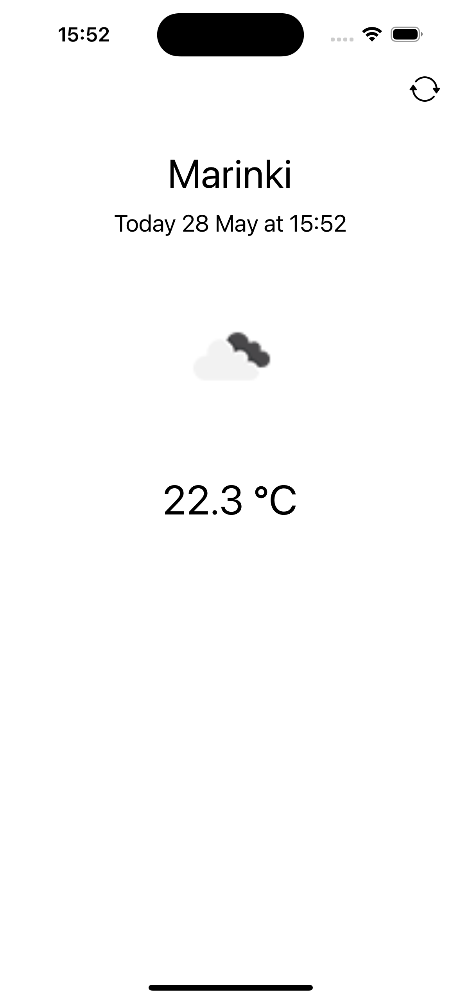
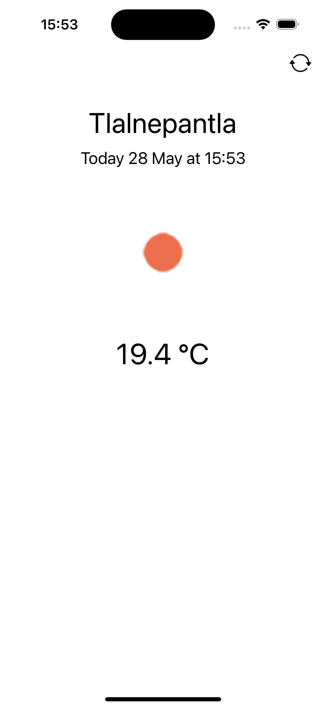

# Weather

Реализация приложения Погода

## About

Стек технологий:

* Grand Central Dispatch (GCD)
* URLSession
* LCLocation

## How it work

> При загрузке приложения разрешаем делиться "при использовании" геоданных. При обновлении места, нажимаем "🔄". Данные получаем с OpenWeather.

## Example

  
  
  
  

## Support

tg: @swissmer